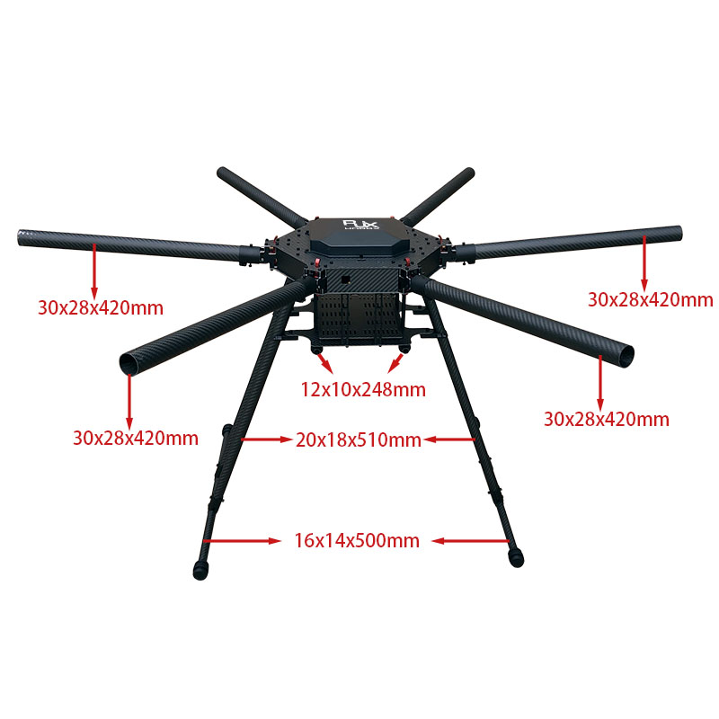

# Hexacopter Build Project
Welcome to the Hexacopter Build Project! Follow along as I embark on a journey to create a powerful 1300mm hexacopter from scratch. With a focus on scalability and payload capacity, I'm integrating top-tier components like a carbon fiber frame from RJX Hobby, Hobbywing XRotor X6 motors and a 12s smart battery, alongside exploring the Cube Pilot ecosystem for advanced flight control. I’ll also incorporate a companion computer and some cool cameras and imaging devices to explore things like photogrammetry and thermal imaging. From frame assembly to flight tuning, join me as I document every step of this exciting build, sharing my insights, code, and comprehensive parts list along the way. Let's push the boundaries of drone technology together!

For details [click here to access the wiki and documentation home folder.](./wiki/Drone-Wiki.md)

