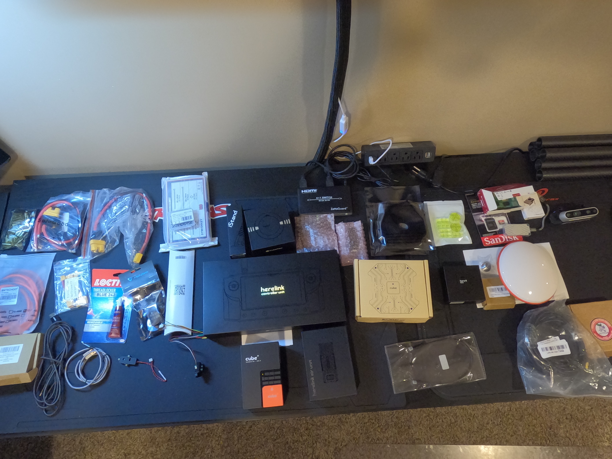

This page contains an overview of the electronics to be installed in the Drone.
The complete list of parts bought can be foud on the [bill of materials page](../0-Bill-of-Materials/Bill-of-Materials.md) - This page contains the overall bill of materials/component list that was used to construct the drone.

# YouTube Video
- [Hexacopter Drone Build Project – Part 2 Electronics Inventory](https://www.youtube.com/watch?v=9nkmOGkzU3E)

# References 
## Kore Multi-Rotor Carrier Board
- Details about the Kore carrier board [can be found here](https://docs.spektreworks.com/carrier_board_v1_3_1/).
- You can download STL files to 3d print a case for the Kore carrier board [from here](https://www.spektreworks.com/products/multi-rotor-pixhawk21-carrier-board). We dont use this in this project, but it may be an option for yours.

## Cube Pilot
Cube pilot product documentation [can be found here](https://docs.cubepilot.org/user-guides).

## Hereflow 3d Printed Case
You can download and 3d print a case for the HereFlow [from here](https://discuss.cubepilot.org/t/hereflow-3d-printed-enclosure/1890/8).

# Pictures
