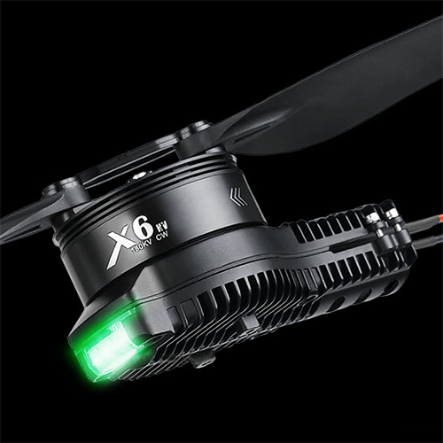
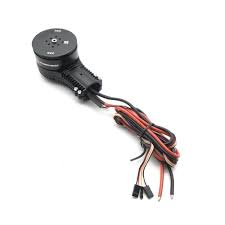

This page contains details about the motors on the drone. I used the [Hobbywing XRotor X6 Plus system](https://www.hobbywingdirect.com/products/xrotor-x6-plus). These motors use CAN communication for real-time data transmission back to the flight controller such as RPM, temperature, current and voltage.

# YouTube Video
- [Hexacopter Drone Build Project – Part 6 Motors](https://youtu.be/Da3giR6eTWk)

# Notes
- When I powered the motor with a 6s battery it beeped twice every second. This means the voltage is too low for the motor. When I put a bigger battery in it beeped once every 3 seconds, meaning its ready but not connected to a flight controller. Once a flight controller connects it will give a solid tone for a second and then make no more sounds.
- Be sure to set your motor node and throttle IDs to correspond with the proper motor rotation.
  - Clockwise Motors are #1, 3, 6
  - Counter-Clockwise Motors are #2, 4, 5
- To attach the props to the motors you will need 4 x 10mm M3 socket head screws per motor.

# Supporting Materials
- [ArduPilot Configuration](../ArduPilot-Config/ArduPilot-Config.md) - This page contains a consolidated list of the all of the configuration done in ArduPilot throughout the videos.
- [DroneCAN GUI Tool](https://dronecan.github.io/GUI_Tool/Overview/) - a coss-platform free open source application for DroneCAN bus management and diagnostics.

# References 
- [Setting up Hobbywing DroneCAN ESCs with ArduPilot](https://www.youtube.com/watch?v=2fQBczEFnO8) - Great video from Andrew Tridgell showing how to setup the HobbyWing XRotor DroneCAN motors.
- [ArduPilot Docs Hobbywing DroneCAN ESC](https://ardupilot.org/copter/docs/common-hobbywing-dronecan-esc.html) - ArduPilot documentation page on setting up the Hobbywing ESCs.
- [The Cube User Manual V1.0](https://docs.cubepilot.org/user-guides/autopilot/the-cube-user-manual) - Contains information on setup of the cube, including motor orientation.
- [Hobbywing XRotor X6 Motor Manual](https://manuals.plus/hobbywing/xrotor-pro-x6-manual)

# How to Change the LED Light Color
Unscrew the two M3*8 screws for fastening the light cover with a screwdriver, slide the DIP switches accordingly (as shown below) to change the light color (it’s Green by default), mount the cover back after setting.

|DIP Switch 1|DIP Switch 2|DIP Switch 1|Color of the LED|
|---|---|---|---|
|ON|ON|ON|White
|ON|OFF|ON|Light Blue
|ON|ON|OFF|Purple
|ON|OFF|OFF|Blue
|OFF|ON|ON|Yellow
|OFF|OFF|ON|Green
|OFF|ON|OFF|Red
|OFF|OFF|OFF|LED Disabled

# Firmware / Hobbywing DataLink
Hobbywing DataLink will allow you to see what firmware version is running on the ESCs and set ESC parameters. [Click here for the DataLink v2 user manual.](https://support.hobbywingdirect.com/hc/en-us/article_attachments/21956106298003)

[This page](https://support.hobbywingdirect.com/hc/en-us/articles/20205555624979-X-Series-Firmware-Update-Instructions) also has instructions for updating the X Series motor firmware.

1. [Download here](https://www.hobbywing.com/en/service/application.html?id=3)
1. Extract the zip file
1. Run DataLink.exe
1. Connect the esc connection to the CH1/CL1 port on the datalink box. The  yellow/white/green 3 wire connection is what connects to this port. The yellow cable connects to the - port (the furthest pin on the left). White is CANH and green is CANL.
1. Connect a USB-C cable between the DataLink box and your computer.

## Upgrade the DataLink Box Firmware
1. In the DataLink application, on the Firmware Upgrade tab, click on "DataLink" in the radio buttons on the left.
1. Update the firmware if an update is available. My DataLink unit came with firmware LINK-01.2.09-U, and there was an upgrade available to version LINK-01.2.14-C
1. After updating you must power cycle the DataLink unit. 

## Upgrade the ESC Firmware
1. In the DataLink application, on the Firmware Upgrade tab, click on "Can->ESC(FAST)" in the radio buttons on the left.
1. Set the communication information to 500 Khz (or 1MHz if you changed its bus speed already), Hobbywing, ESC Drive. Press the Communication Setting button.
1. Press the Scanning button.
1. Power the ESC.
1. As soon as a device shows in the list press stop.
1. If there is a new version in the Available version drop down you can select it and press update.

# Pictures

