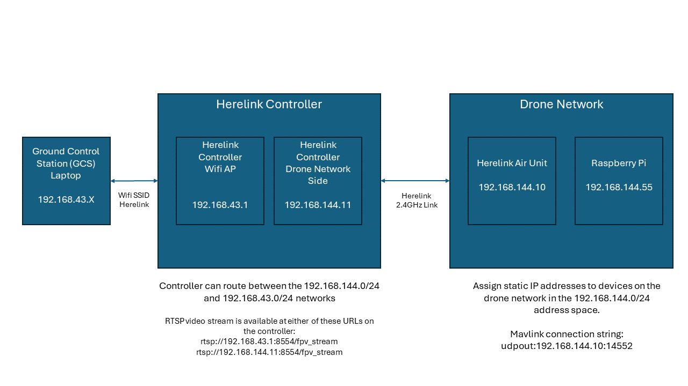

This page contains details on the installation of a Raspberry Pi 5 companion computer and the setup of a BotBlox SwitchBlox Ethernet switch to create a network onboard the drone.

# YouTube Video
- [Hexacopter Drone Build Project – Part 10 Onboard Computer and Ethernet](https://youtu.be/5UbClGg2NsM)


# Notes
- 192.168.43.1 is Herelink controller IP address when you connect to it through it's WiFi access point mode from a ground control station (i.e., a laptop or computer).
- There is no dhcp provided by the Herelink Air Units. You need to manual set an ip address inside the range eg 192.168.144.0, subnet mask 255.255.255.0. For example, use 192.168.144.50. This will put you within the IP range of the airunit and GCS unit, so they are accessible from the airunit ethernet port.
  - The Airunit and Controller occupy the addresses 192.168.144.10 and 192.168.144.11, so you cannot use these IP addresses for other devices on the network within the drone.
  - Herelink Air Unit is at IP address 192.168.144.10
  - Herelink Controller is at IP address 192.168.144.11
- You can get rtsp video from 192.168.43.1, 192.168.144.10, or 192.168.144.11
- You can get mavlink from 192.168.43.1, 192.168.144.10 (Herelink Air Unit), or 192.168.144.11 (Herelink Controller) port 14552
- To be able to route traffic between the Drone Network and the Ground Control Station Herelink WiFi AP:
  - GCS/Laptop needs a static route to 192.168.144.0/24 via 192.168.43.1
    - To do this, assuming your GCS is a Windows PC, open a command prompt as administrator and run `route add 192.168.144.0 mask 255.255.255.0 192.168.43.1`
    - To make the route persistent across reboots, run it with the -p flag: `route -p add 192.168.144.0 mask 255.255.255.0 192.168.43.1`
  - Companion computer needs a static route for 192.168.43.0/24 via 192.168.144.11
    - To do this temporarily, run the command: `sudo ip route add 192.168.43.0/24 via 192.168.144.11`
    - To do it permanently, simply leave in the routes section in the static IP configuration as shown below.
- RTSP URLs:
  - for the RTSP video stream on the Herelink Controller is: rtsp://192.168.43.1:8554/fpv_stream or rtsp://192.168.144.11:8554/fpv_stream
  - for the RTSP video stream on the Herelink Air Unit is: rtsp://192.168.144.10:8554/H264Video
  - You can connect to that using a tool such as VLC Media Player
- I've found trying to download logs to the Raspberry Pi using Mavlink and Ethernet is very slow. It gets data in 90 byte chunks. For this reason, I added a serial link between the Raspberry Pi and the Kore carrier board.
  - One end connects to the GPS2 (SER4/I2C2) port. This is SERIAL4 in ArduPilot then.
  - TX from the Kore connects to RX on the Raspberry Pi (Pin 10, GPIO15/RXD).
  - RX from the Kore connects to TX on the Raspberry Pi (Pin 8, GPIO14/TXD).
  - Ground from the Kore connects to Groun on the Raspberry Pi. (Pin 39)
  - Then set these ArduPilot parameters:
    - SERIAL4_PROTOCOL = 2 to enable MAVLink 2 on the serial port.
    - SERIAL4_BAUD = 921
  - Then on the Raspberry Pi, follow the instructions in the `Raspberry Pi Serial Port Setup` section below.


# Sudo Setup
- Make it so the ubuntu user can sudo without a password
```sh
sudo visudo
```
Add this line at the end (replace ubuntu with the userid you want to sudo without a password)

```sudo
ubuntu ALL=(ALL) NOPASSWD: ALL
```


# Setting An IP Address on the Raspberry Pi
The following commands will give your Raspberry Pi a static IP address that will allow it to communicate with the Herelink Air Unit, Controller, and the Ground Control Station (if connected through the WiFi AP on the Herelink controller). 

- Open the Netplan configuration file for editing: `sudo vi /etc/netplan/01-netcfg.yaml`
- Edit the configuration file to set the static IP address. The file should look something like this
```
network:
  version: 2
  ethernets:
    eth0:
      addresses:
        - 192.168.144.55/24
      dhcp4: no
      routes:
        - to: 192.168.43.0/24
          via: 192.168.144.11
```
- After saving the file, apply the Netplan configuration with the following command: `sudo netplan apply`
- Verify the configuration. You can check the IP address assignment by using the ip command: `ip addr show eth0`


# Updating Ubuntu Server to Ubuntu Desktop
After installing Ubuntu server, you may wish to enable the graphical desktop. You can do that by running the commands below:
```sh
sudo apt update
sudo apt upgrade
sudo apt install ubuntu-desktop -y
sudo apt install xrdp -y
sudo usermod -aG sudo ubuntu
sudo systemctl set-default graphical.target
sudo reboot
```


# Raspberry Pi Serial Port Setup
To setup the serial port on the Raspberry Pi top be able to connect it to the flight controller, you need to do some configuration on the Pi:
1. Edit /boot/firmware/config.txt
  - On the Raspberry Pi 5 you have to edit `/boot/firmware/config.txt` and set these two params:
  ```
  enable_uart=1
  dtoverlay=uart0
  ```
  - And on a Raspberry Pi 4 you have to edit `/boot/firmware/config.txt` and set these three params instead:
  ```
  enable_uart=1
  dtoverlay=uart0
  dtoverlay=disable-bt
  ```
2. Remove ModemManager, it will conflict with your serial port:
```sh
sudo apt remove modemmanager
```
3. Ensure permissions are set correctly on /dev/ttyAMA0
```sh
sudo chown root:dialout /dev/ttyAMA0
sudo chmod 660 /dev/ttyAMA0
```
4. Add user to the dialout group:
```sh
sudo usermod -aG dialout ubuntu
```
5. Disable agetty on /dev/ttyAMA0
agetty is typically used for serial console access. If you don't need this, disable it. It is possible it isn't enabled already, if not then that's OK:
```sh
sudo systemctl stop serial-getty@ttyAMA0.service
sudo systemctl disable serial-getty@ttyAMA0.service
```
6. Remove serial console access from the boot configuration:
```sh
sudo vi /boot/firmware/cmdline.txt
```
Remove any reference to console=serial0,115200 or console=ttyAMA0.
7. Reboot
```sh
sudo reboot
```
8. To test if it's working, you can try to connect with mavproxy:
```sh
pip3 install mavproxy
mavproxy.py --master=/dev/ttyAMA0 --baudrate=921600
```


# Python and Pymavlink
You may wish to interact with your drone from your companion computer using Python. This section shows the basics of how to communicate with the ArduPilot flight controller.

- [Pymavlink](https://github.com/ArduPilot/pymavlink) is a Python library for generating and parsing MAVLink messages. MAVLink (Micro Air Vehicle Link) is a communication protocol used primarily in drone applications for telemetry and command/control communication.

1. Install dependencies: `sudo apt update && sudo apt install python3-full python3-pip python-is-python3`
1. Create a python virtual environment: `python3 -m venv drone01`
1. Activate virtual environment: `source drone01/bin/activate`
1. Install python libraries into the virtual environment: `pip3 install pymavlink`
1. Try a simple test program to communicate with the flight controller. Create a file named `sample01_simple_mavlink_test.py` and add the contents of [this file](../../src/sample01_simple_mavlink_test/sample01_simple_mavlink_test.py) to it.
1. Run the program: `python sample01_simple_mavlink_test.py`
1. Deactivate the virtual environment: `deactivate`
1. Delete the virtual environment: `rm -rf drone01`


# Stream a video to the Console
You can use these commands to install mplayer, download a sample mp4, and stream it to the console so that it displays on your Herelink.
```sh
sudo apt install mplayer -y
wget https://download.blender.org/peach/bigbuckbunny_movies/BigBuckBunny_320x180.mp4 -O big_buck_bunny.mp4
sudo mplayer -vo fbdev2 big_buck_bunny.mp4
```


# Display an RTSP Stream
Install ffplay or vlc:
```sh
sudo apt install vlc -y
sudo apt install ffmpeg -y
```

Launch the stream:
```sh
# To pull it from the controller:
vlc rtsp://192.168.144.11:8554/fpv_stream
ffplay rtsp://192.168.144.11:8554/fpv_stream

# To pull it from the air unit:
ffplay rtsp://192.168.144.10:8554/H264Video
```

# Install I2C Tools
If you want to connect devices to the I2C bus on the Raspberry Pi, you will want the I2C tools to be able to view devices attached to the bus:
```sh
sudo apt install -y i2c-tools
```
And then you can run a command like to view devices on I2C bus #1:
```sh
i2cdetect -y 1
```

# Supporting Materials
- [Raspberry Pi Imager](https://www.raspberrypi.com/software/) - Download and install the Raspberry Pi Imager from this website.
- [PuTTY SSH Client](https://www.putty.org/) - Free SSH client you can use to connect to your Raspberry Pi.
- [VLC Media Player](https://www.videolan.org/) - Used to view RTSP video streams over a network connection.
- [ArduPilot Configuration](../ArduPilot-Config/ArduPilot-Config.md) - This page contains a consolidated list of the all of the configuration done in ArduPilot throughout the videos.


# References 
- Herelink air unit to botblox switch wiring is shown [on this page](https://ardupilot.org/copter/docs/common-ethernet-vehicle.html).
- ArduPilot discussion post on Ethernet Connected Ardupilot Vehicle Example [can be found here](https://discuss.ardupilot.org/t/ethernet-connected-ardupilot-vehicle-example/117942).
- [Communicating with Raspberry Pi via MAVLink and Serial Port Wiring](https://ardupilot.org/dev/docs/raspberry-pi-via-mavlink.html)


# Pictures


Raspberry Pi 5 Pinout
