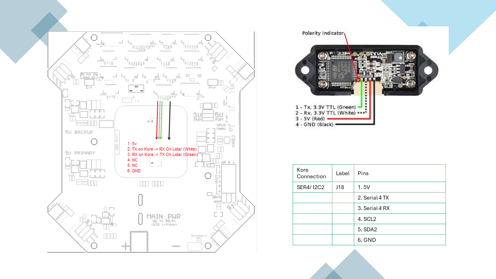
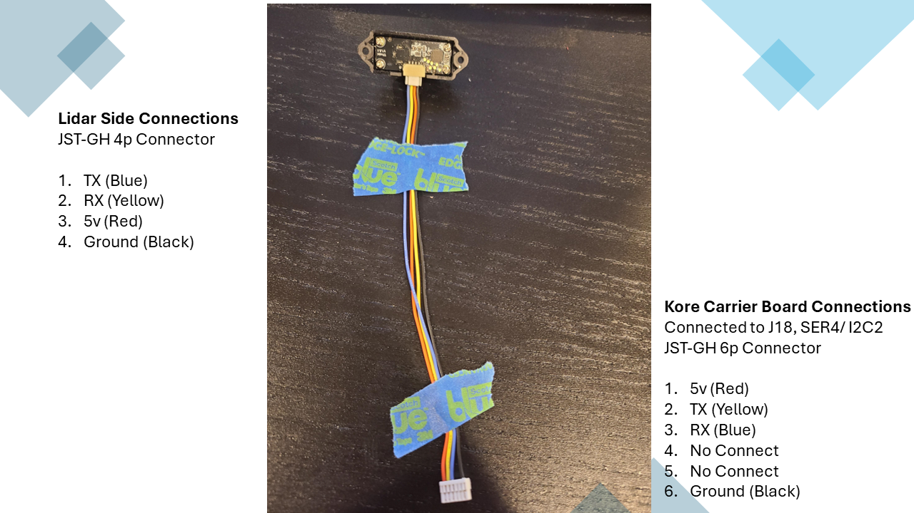

This page contains details on the setup of the Benewake TFMini-S Lidar. This Lidar connects using a serial interface.

Performance characteristics are:
- Measurement Range: 0.1 to 12 meters (indoor conditions) and 0.1 to 7 meters (outdoor conditions).
- Accuracy: ±6 cm within 0.1 to 6 meters; ±1% of distance within 6 to 12 meters.
- Resolution: 1 cm.

# YouTube Video
- [Hexacopter Drone Build Project – Part 11 TFMini-S Lidar](https://youtu.be/6i_XVjCSzAI)

# Notes
- TX from the Lidar connects to RX on the Kore carrier board.
- RX from the Lidar connects to TX on the Kore carrier board.
- See pictures below for examples.
- You can also setup this LiDAR to be a DroneCAN device using a [Matek AP_PERIPH CAN Node L431 Board](https://www.mateksys.com/?portfolio=can-l431)
  - You must first install the latest firmware to enable seeing the rangefinder parameters.
  - Download the latest firmware from here for the L431 board (download the .bin file): https://firmware.ardupilot.org/AP_Periph/stable/MatekL431-Rangefinder/
  - In Mission Planner, go to Setup->Optional Hardware->DroneCAN/UAVCAN
  - Connect to the CAN interface (CAN1 or CAN2) that your device L431 device is connected to.
  - In the menu button on the row for your device, press update. Select No when it asks to search the internet for an update.
  - You will be prompted for the firmware file to load. Select the .bin file downloaded earlier.
  - After updating, select the menu button again to open the parameters for the L431 node.
  - Set RNGFND1_TYPE to 20 and press write params.
  - Refresh params in the L431 and then also set:
    - RNGFND_BAUDRATE=115200
    - RNGFND_PORT=2
    - RNGFND_GNDCLEAR=set to distance in centimeters that your rangefinder reads to the ground.
    - RNGFND_MAX_CM=600
    - RNGFND_MIN_CM=10
  - Now go into Mission Planner->Config->Full Parameter List
    - Set RNGFND2_TYPE=24
- If you are going to setup multiple rangefinders, then you must open the DroneCAN parameters for the device and set the CAN node ID to a unique number. Then you must set RNGFND1_ADDR to the node ID you assigned to the L431 device. For example I used 45 for my TFMini-S and 46 for my HereFlow rangefinder. Dont use an ID for an existing device listed in the Setup->Optional Hardware->DroneCAN/UAVCAN list either.
- You dont want two identical lidar pointing in the same direction. The most likely outcome is that the lidar will become confused if they pickup the laser sent from the other lidar.

# Supporting Materials
- [ArduPilot Configuration](../ArduPilot-Config/ArduPilot-Config.md) - This page contains a consolidated list of the all of the configuration done in ArduPilot throughout the videos.

# References 
- Ardupilot TFMini guide [can be found here](https://ardupilot.org/copter/docs/common-benewake-tfmini-lidar.html).
- Download the latest firmware [from here for the L431 board (download the .bin file)](https://firmware.ardupilot.org/AP_Periph/stable/MatekL431-Rangefinder/)

# Pictures

