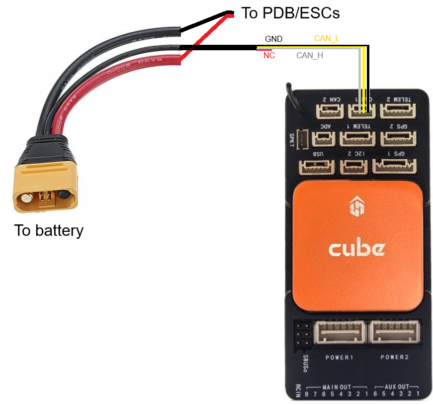

This page contains details on the setup of the Tattu smart battery. Tattu Plus batteries with AS150U connectors support DroneCAN which allows the autopilot to retrieve the battery’s total voltage, individual cell voltages, current, temperature and percentage of remaining capacity.

# YouTube Video
- [Hexacopter Drone Build Project – Part 12 Tattu Smart Battery](https://youtu.be/B040AUwVVrQ)
- [How to Update the Firmware on Your Tattu TA3200 Smart Charger | Step-by-Step Guide](https://www.youtube.com/watch?v=zrvEaCpQMPI&t=32s)

# Notes
- I could NOT get the telemetry to reliably read on the CAN bus if the battery was connected to the same CAN port as the HobbyWing motors. In my configuration the motors, GPS, HereFlow, and Cube ID are all connected to CAN1, and the battery is connected to CAN2.
- Be sure to have both CAN ports enabled, and a different driver setup for each through these ArduPilot parameters:
    |Parameter Name|Value|Description|
    |---|---|---|
    |CAN_P1_DRIVER|1||
    |CAN_P2_DRIVER|2||
    |CAN_D1_PROTOCOL|1|DroneCAN|
    |CAN_D2_PROTOCOL|1|DroneCAN|
- On the wiring of the data pins from the battery:
  - CAN_H is the white wire
  - CAN_L is the yellow wire
  - The red wire is NOT connected. 
- TA3200 Charger Firmware updates are done by following these steps (which can be found from [Tattu on Youtube here](https://www.youtube.com/watch?v=PMu2slkg2XQ)):
  - Download latest firmware from the [Tattu downloads page](https://www.grepow.com/downloads.html). It will be under the "TA3200 LiPo Charger Firmware Upgrade Package"
  - Open the update software.
  - Press the left button and holding the button while you power on the charger.
  - Connect the USB cable between the charger and your computer.
  - Press update on the charger firmware update software.
  - Restart the charger and note the new firmware version.
- You enter setup mode on the TA3200 Charger by following these steps (which can be found from [Tattu on Youtube here](https://www.youtube.com/watch?v=xU64uayYcXM)):
  - Quickly press the Left -> Up -> Down buttons in sequence

# Supporting Materials
- [ArduPilot Configuration](../ArduPilot-Config/ArduPilot-Config.md) - This page contains a consolidated list of the all of the configuration done in ArduPilot throughout the videos.

# References 
- Ardupilot Tattu DroneCAN battery guide [can be found here](https://ardupilot.org/plane/docs/common-tattu-dronecan-battery.html).

# Images
