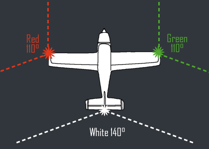

This page contains details on adding some basic navigation lights to the drone.

# YouTube Video
- [Hexacopter Drone Build Project – Part 14 Navigation Lights](https://youtu.be/iyrwQGt4RnM)

# Notes
- See pictures below for a reference on how the lights are configured on airplanes.
- It's important to note that the auxiliary ports of the Kore carrier board map to servo ports starting at 9. So:
  - Kore Carrier Board Auxiliary Port 1 = SERVO9
  - Kore Carrier Board Auxiliary Port 2 = SERVO10
  - Kore Carrier Board Auxiliary Port 3 = SERVO11
  - Kore Carrier Board Auxiliary Port 4 = SERVO12
  - Kore Carrier Board Auxiliary Port 5 = SERVO13
  - Kore Carrier Board Auxiliary Port 6 = SERVO14
- On my Herelink controller, I setup the D button short press to be a toggle for channel 6. Default value is 1000, and active value is 2000. I then set SERVO9_FUNCTION to 56 in the Mission Planner parameters for the flight controller to 56. This configures the port for RC Pass thru. 56 = RCIN6 which means RC channel 6 gets output to SERVO9.

# Supporting Materials
- [ArduPilot Configuration](../ArduPilot-Config/ArduPilot-Config.md) - This page contains a consolidated list of the all of the configuration done in ArduPilot throughout the videos.

# Pictures

