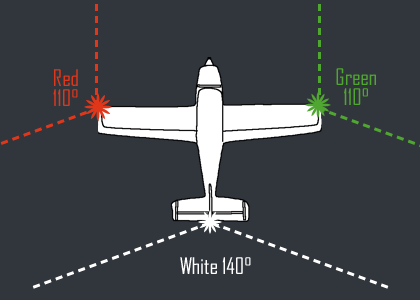

This page contains details on adding some basic navigation lights to the drone.

# YouTube Video
- [Hexacopter Drone Build Project – Part 15 Navigation Lights](https://youtu.be/XXX)

# Notes
- See pictures below for a reference on how the lights are configured on airplanes.

# Supporting Materials
- [ArduPilot Configuration](../ArduPilot-Config/ArduPilot-Config.md) - This page contains a consolidated list of the all of the configuration done in ArduPilot throughout the videos.

# Pictures

