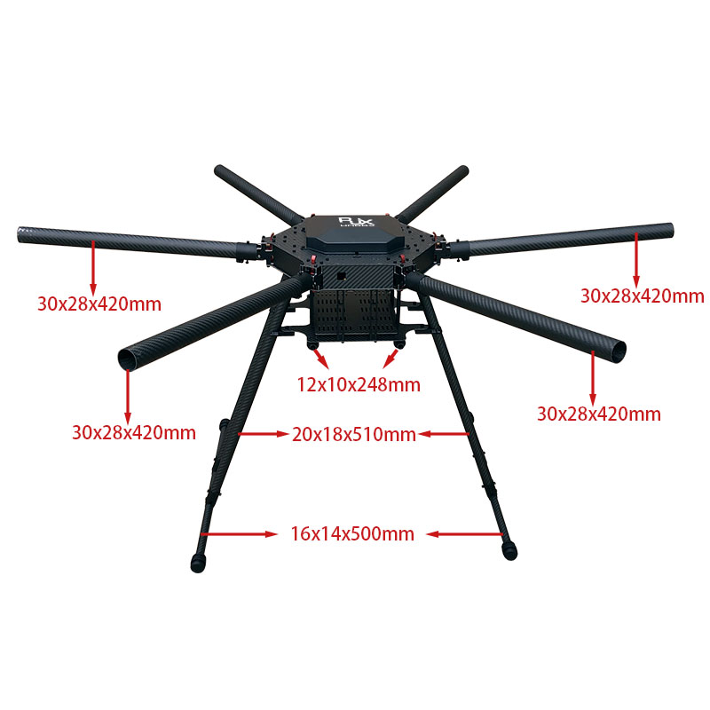

Welcome to the Hexacopter Build Project! Follow along as I embark on a journey to create a powerful 1300mm hexacopter from scratch. With a focus on scalability and payload capacity, I'm integrating top-tier components like a carbon fiber frame from RJX Hobby, Hobbywing XRotor X6 motors and a 12s smart battery, alongside exploring the Cube Pilot ecosystem for advanced flight control. I’ll also incorporate a companion computer and some cool cameras and imaging devices to explore things like photogrammetry and thermal imaging. From frame assembly to flight tuning, join me as I document every step of this exciting build, sharing my insights, code, and comprehensive parts list along the way. Let's push the boundaries of drone technology together!

# YouTube Play List
All of the YouTube videos linked in this wiki are organized into a [single playlist](https://www.youtube.com/playlist?list=PLT3XAJfSsN4FFodHkPWbuXHesVJ0ILG6v) you can watch as well. Follow each part of the video playlist in order.

# Preparation
- [Prep Work](Preparation/Preparation.md) - Prior to building and flying your drone, complete this prep work around knowledge, safety, and compliance.

# Bill of Materials
- [Overall BOM](00-Bill-of-Materials/Bill-of-Materials.md) - This page contains the overall bill of materials/component list that was used to construct the drone.

# Step by Step Build Process
Use the list below to follow my build journey step by step.
1. [Frame](01-Frame/Frame.md)
1. [Electronics](02-Electronics-Inventory/Electronics-Inventory.md)
1. [Herelink Unboxing and Configfuration](03-Herelink-Initial-Config/Herelink-Initial-Config.md)
1. [Cube Orange Plus and Kore Carrier Board Unboxing and Configfuration](04-Cube-Orange-Plus-and-Kore-Carrier-Board-Initial-Setup/Cube-Orange-Plus-and-Kore-Carrier-Board-Initial-Setup.md)
1. [Here 4 GPS and Base](05-Here-4-GPS-and-Base/Here-4-GPS-and-Base.md)
1. [Motors](06-Motors/Motors.md)
1. [Onboard OLED Display](07-OLED-Display/OLED-Display.md)
1. [Cube ID Remote ID](08-Cube-ID-Remote-ID/Cube-ID-Remote-ID.md)
1. [Here Flow](09-Here-Flow/Here-Flow.md)
1. [Onboard Computer and Ethernet](10-Onboard-Computer-and-Ethernet/Onboard-Computer-and-Ethernet.md)
1. [TFMini-S Lidar](11-TFMini-S-Lidar/TFMini-S-Lidar.md)
1. [Tattu Smart Battery](12-Tattu-Smart-Battery/Tattu-Smart-Battery.md)
1. [Electronics Installation](13-Electronics-Installation/Electronics-Installation.md)
1. [Navigation Lights](14-Navigation-Lights/Navigation-Lights.md)
1. [Peripheral Updates](15-Peripheral-Updates/Peripheral-Updates.md)
1. [Gimbal and Camera](16-Gimbal-and-Camera/Gimbal-and-Camera.md)
1. [Obstacle Avoidance LiDAR](17-Obstacle-Avoidance-LiDAR/Obstacle-Avoidance-LiDAR.md)
1. [Scanning Lights / Cylon Pattern](18-Scanning-Lights/Scanning-Lights.md)

<!--1. [Methodic Configuration](XX-Methodic-Configuration/Methodic-Configuration.md)-->
<!--1. [ROS Integration](XX-ROS-Integration/ROS-Integration.md)-->

Future steps are coming soon!

# Drone Weight
The weight of this drone is as follows:
- 21.64 lb without battery or payload (just frame, motors, electronics, etc).
- 31.30 lb with battery (The battery is 9.66 lb).
- 27.15 lb with payload and no battery (5.51 lb payload). The payload is the Gremsy T7 Gimbal, Sony A6500 Camera, and supporting electronics.
- 36.85 lb with battery and payload

# Flight Checklist
- [Flight Checklist](Flight-Checklist/Flight-Checklist.md) - This page contains a simple checklist of items to work through before flying.

# Full ArduPilot Configuration Summary
- [ArduPilot Configuration](ArduPilot-Config/ArduPilot-Config.md) - This page contains a consolidated list of the all of the configuration done in ArduPilot throughout the videos.
- However, I would recommend you use the [ArduPilot Methodic Configurator](https://ardupilot.github.io/MethodicConfigurator/TUNING_GUIDE_ArduCopter) with [these config files](../ardupilot-methodic-configurator/Hexacopter/) that I have created. This is how I setup and tuned the drone in its final stages.

# ArduPilot Tools
- [DroneCAN GUI Tool](https://dronecan.github.io/GUI_Tool/Overview/) - a coss-platform free open source application for DroneCAN bus management and diagnostics.
- [Mission Planner](https://ardupilot.org/planner/docs/mission-planner-installation.html) - A GCS allows users to set-up, configure, test, and tune the vehicle. 
- [MavProxy](https://ardupilot.org/mavproxy/) - A UAV ground station software package for MAVLink based systems.

# Flight Training
- [RealFlight Simulator](https://www.realflight.com/) - Awesome flight simulator software you can use to learn to safely fly on your computer.
- [How to Fly a Drone A Beginner's Guide to Multirotor Systems & Flight Proficiency by UAV Coach](https://uavcoach.com/how-to-fly-a-quadcopter-guide/) - Need to learn some of the basics of flying? Start with UAV Coach. The information and videos here will give you basic exercises you can practice to improve your flying skills.

# Other Resources
- [eCalc](https://ecalc.ch/) - Services to simulate, calculate, evaluate and design electric brushless motor drives for RC pilots of airplane, multi rotor, UAV, helicopter and EDF jets.
- [How to methodically configure and tune any ArduCopter Blog Post](https://discuss.ardupilot.org/t/how-to-methodically-configure-and-tune-any-arducopter/110842)
- [Measuring Vibration ArduPilot Article](https://ardupilot.org/copter/docs/common-measuring-vibration.html) - These instructions explain how to measure the vibration levels. If you find they are out-of-tolerance then follow the advice found on the ArduPilot Vibration Damping page.
- [Log Analysis in Mission Planner](https://youtu.be/xhBd9KSAfzg?si=X1SPhqCtfS4Ki4Zp) - A video from Dan Benson offering a complete discussion of log analysis in mission planner. He uses a crash to illustrate how to use the log analysis.

# Pictures

