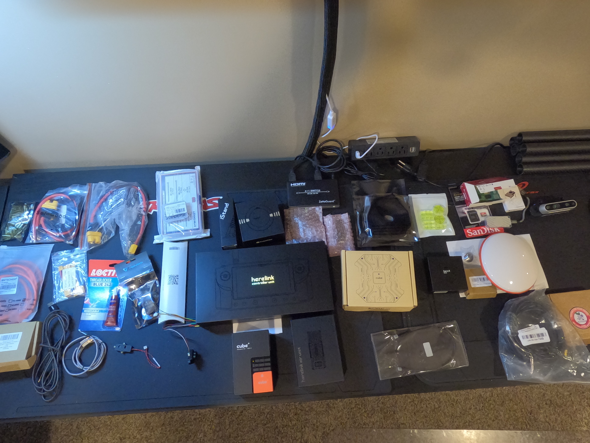

This page contains details about the electronics installation in the Drone.

# YouTube Video
Coming soon.

# Build Notes
Coming soon.

# Kore Multi-Rotor Carrier Board
- Details about the board [can be found here](https://docs.spektreworks.com/carrier_board_v1_3_1/).
- You down download STL files to 3d print a case for the board [from here](https://www.spektreworks.com/products/multi-rotor-pixhawk21-carrier-board).

# Pictures
