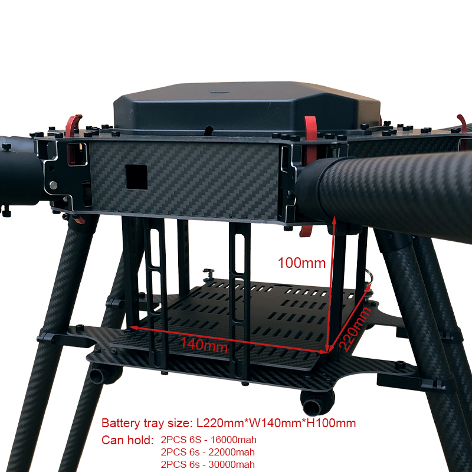

This page contains details about building the frame used for the Drone.

1. Build the RJX1300mm 6-Axis Carbon Fiber Umbrella Folding Hexacopter Frame without motor mounts kit from RJX Hobby. Be sure to also request the optional top battery platform from Kenny. Attach the two GPS mounts to the 30mm carbon fiber tuber, and the AS150U battery connection mount holder to the landing gear.
1. Attach the Hobbywing XRotor X6 Motors to the frame.
1. Attach the AS150U Pigtail connector to the battery connection mount holder on the landing gear.

# Pictures

