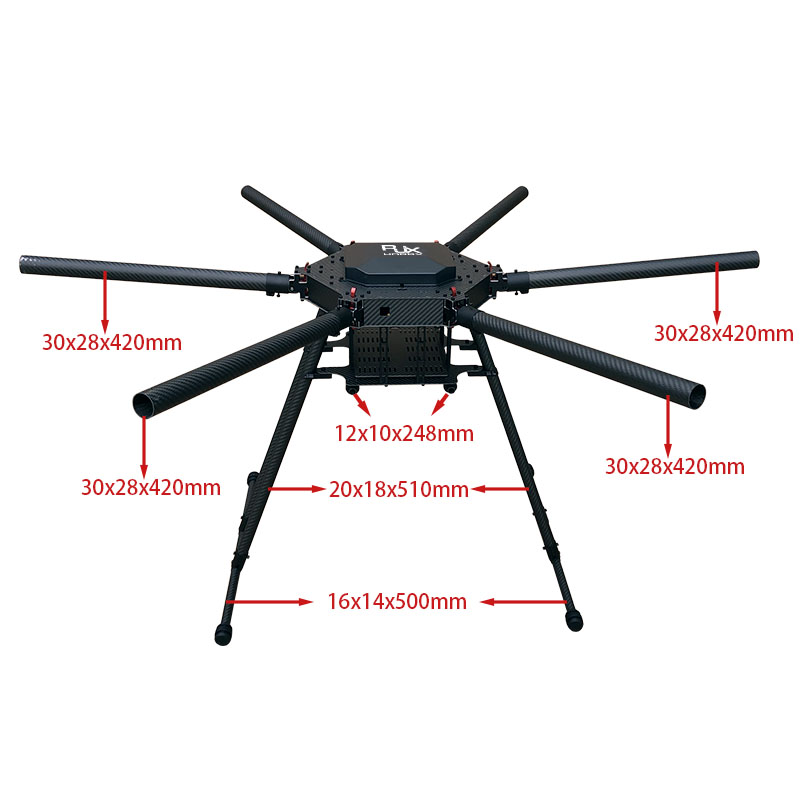

This page contains details about building the frame used for the Drone.

# YouTube Video
I recorded of the frame assembly: [Hexacopter Build Project – Part 1 Frame Assembly](https://youtu.be/STLOE669sC0)

# Build Notes
1. Build the RJX1300mm 6-Axis Carbon Fiber Umbrella Folding Hexacopter Frame without motor mounts kit from RJX Hobby. Be sure to also request the optional top battery platform from Kenny. Attach the two GPS mounts to the 30mm carbon fiber tuber, and the AS150U battery connection mount holder to the landing gear.
   1. Important Build Orientation Notes - On the main body/shell, the side with the hole in it is the front of the frame. Additionally, the battery tray slides out to the rear of the frame.
   2. Order of operations:
      - Remove the slide out battery tray and attach the accessory carbon fiber tube mounts to bottom of tray holder.
      - Attach tray holder to the frame.
      - Attach aluminum ends to the legs.
      - Attach legs to the frame. Be sure to slide on power connector holder on a rear leg.
      - Attach the base of the legs.
      - Attach arms to the frame.
2. Attach the Hobbywing XRotor X6 Motors to the frame.
3. Attach the AS150U Pigtail connector to the battery connection mount holder on the landing gear.

# Pictures

