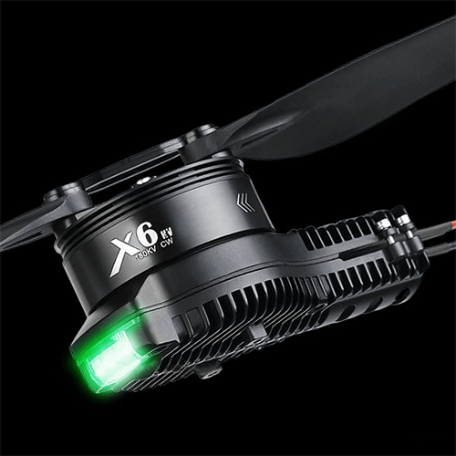
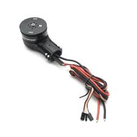

This page contains details about the motors on the drone.

# YouTube Video
Coming soon.

# Build Notes
Coming soon.

# Firmware / Hobbywing DataLink
Hobbywing DataLink will allow you to see what firmware version is running on the ESCs and set ESC parameters. [Click here for the DataLink v2 user manual.](https://support.hobbywingdirect.com/hc/en-us/article_attachments/21956106298003)

[This page](https://support.hobbywingdirect.com/hc/en-us/articles/20205555624979-X-Series-Firmware-Update-Instructions) also has instructions for updating the X Series motor firmware.

1. [Download here](https://www.hobbywing.com/en/service/application.html?id=3)
1. Extract the zip file
1. Run DataLink.exe
1. Connect the esc connection to the CH1/CL1 port on the datalink box. The  yellow/white/green 3 wire connection is what connects to this port. The yellow cable connects to the - port (the furthest pin on the left).
1. Power the ESC and the datalink box.
1. In the DataLink application, on the Firmware Upgrade tab, click on "DataLink" in the radio buttons on the left.
1. Update the firmware if an update is available. My DataLink unit came with firmware LINK-01.2.08-U, and there was an upgrade available to version LINK-01.2.14-C
1. After updating you must power cycle the DataLink unit. 

# Pictures

